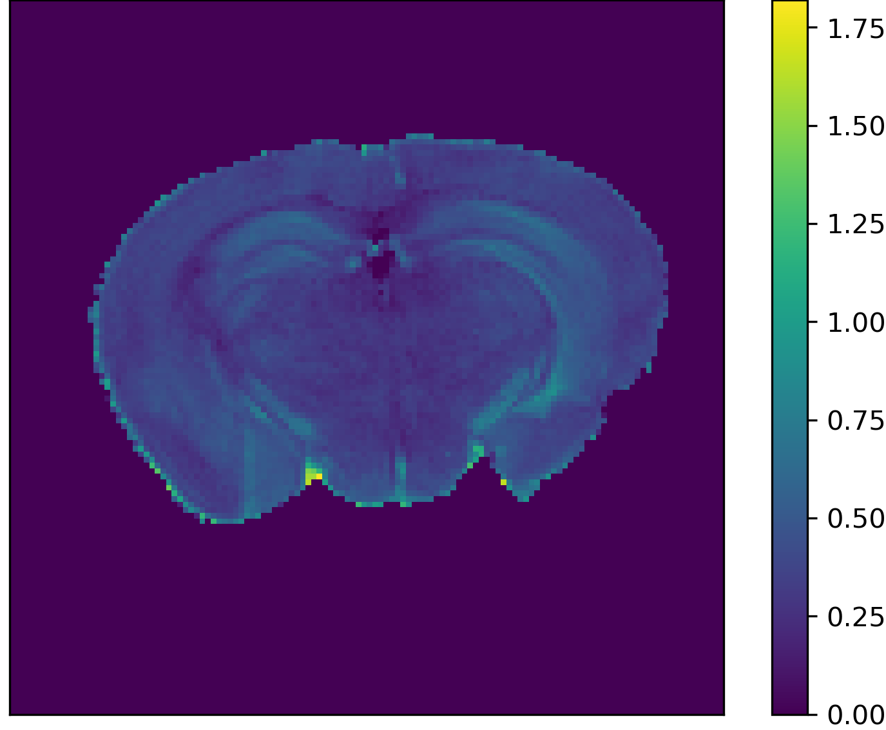
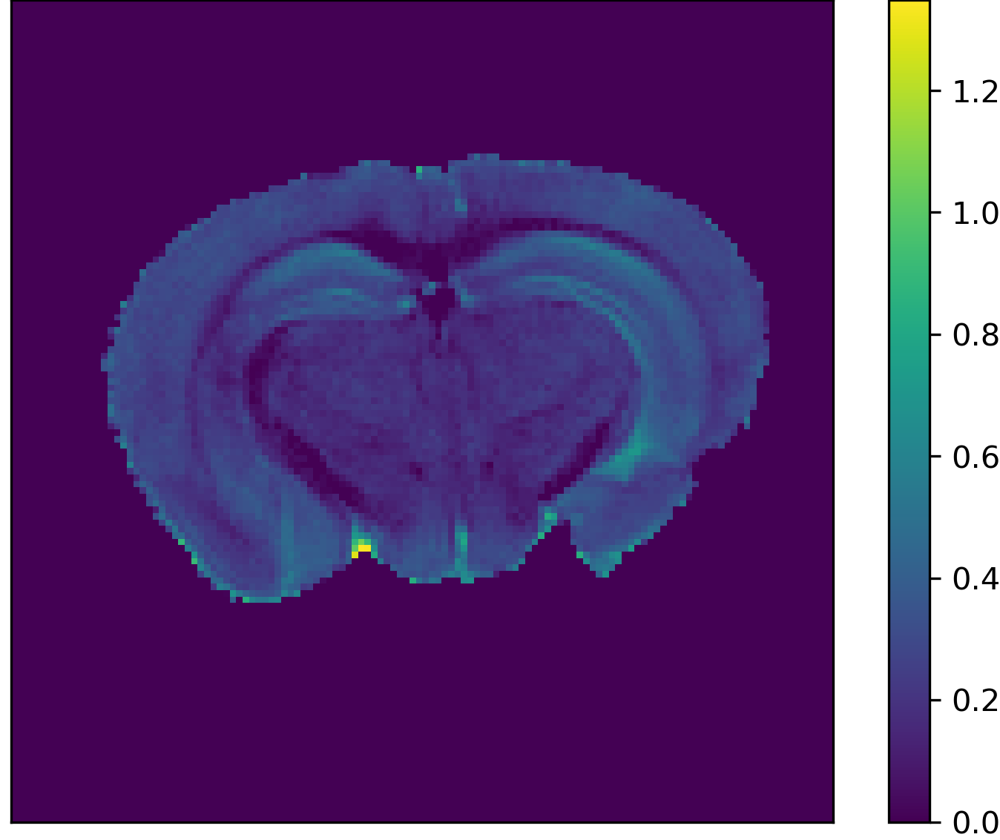
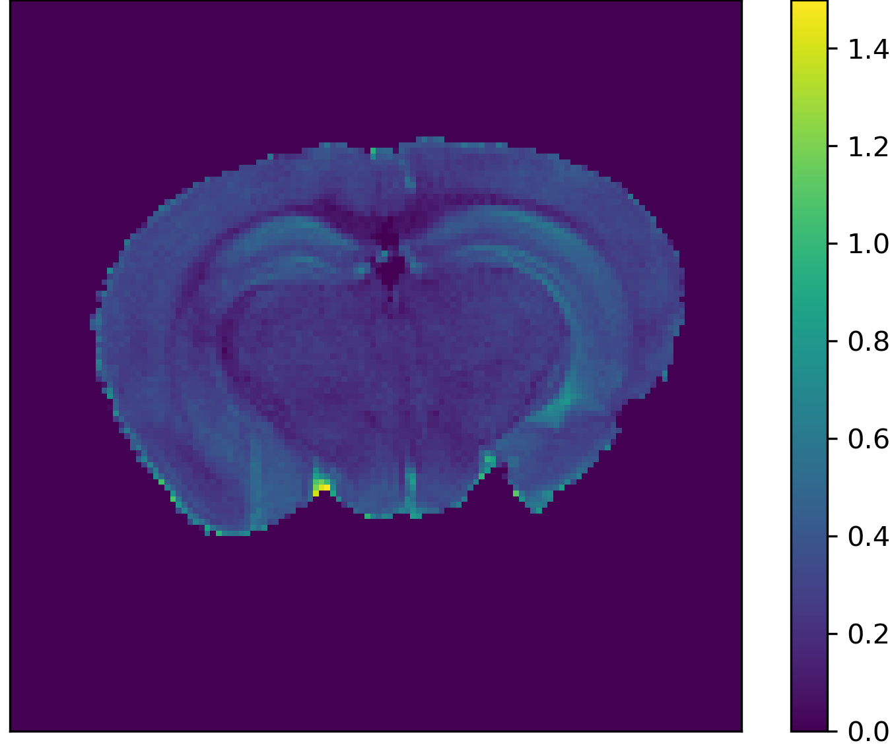
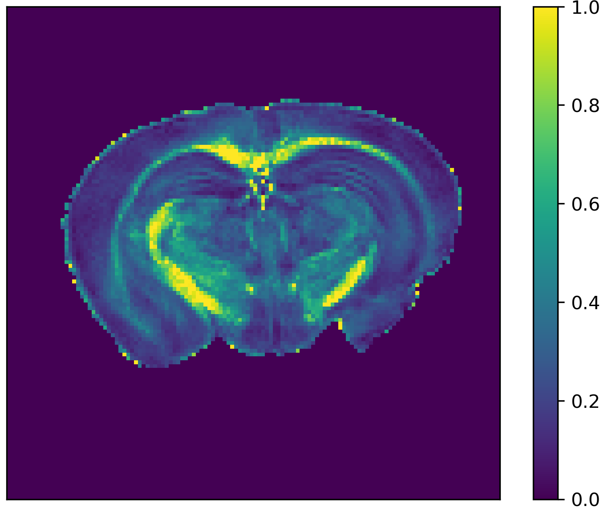
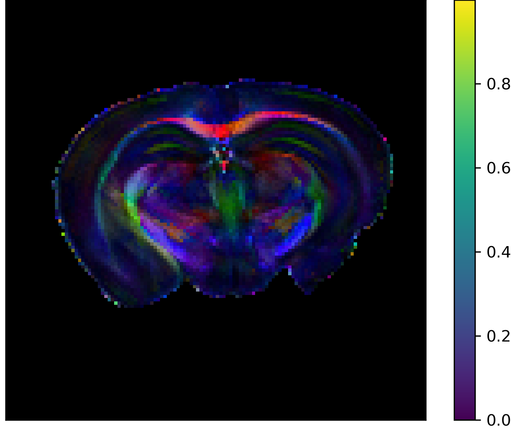
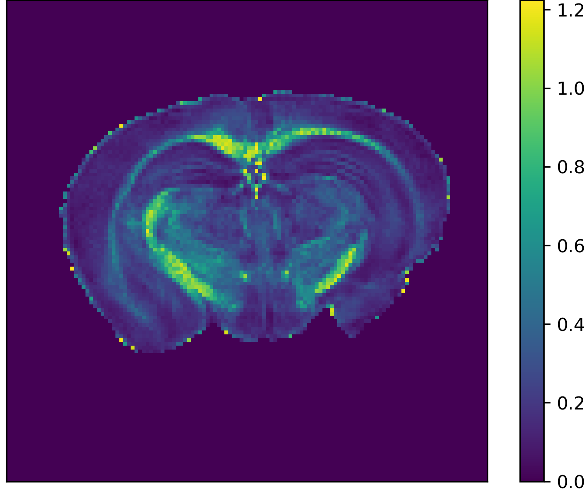
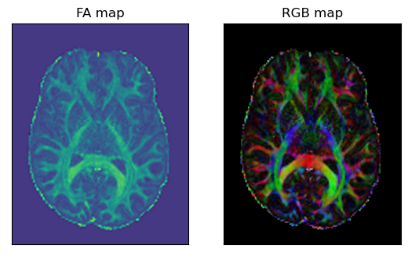

# dMRI reconstrcution from scratch
*[An Introduction to Python-based MRI Data Analysis](https://github.com/zhangerjun/Introduction_To_Python-based_Biomedical_Data_Analysis): mini-project V/VIII*

Team contributor: EJZ

## Summary

## Introduction

## Method
2. dti reconstruction algorithm;
3. basic linear deconposition algorithm;
4. advanced linear deconposition algorithm: to practice NLS method and gready searching method;

## Results and Discussion
* DTI reconstruction results

    
    
    
	
    
    

FA map (left) and color-coded fa map; Both of them were generated by using this basic home-maded algorithm.

    

## Reproducibility

### Dependencies
I test these codes on linux systerm (Ubuntu 22.04). I tried to make these codes only depend on numpy,os, nibabel. These are basic python libararies, thus it should work if you computer can use python3.

* python3;
* python libraries: os, numpy, nibabel (to read and write nifti files).
### Usage

## Conclusion

Deliverables:
* **k means algorithm**: EM algorithm is important to this project. k-means algorithm is an perfect example
    to excersice EM, so I wrote k means from scatch;
* **dMRI reconstration algorithm**: the basic dMRI (DTI) reconstration is necessary to reach this miniproject goal, thus, we will also do this from scratch;
* **db reconstration algorithm**: the db reconstration is main algorithm of this miniproject, I am testing the code for final release.

*Acknowledgement*

This is an interesting mini-project and will be released by the late of December 2022.